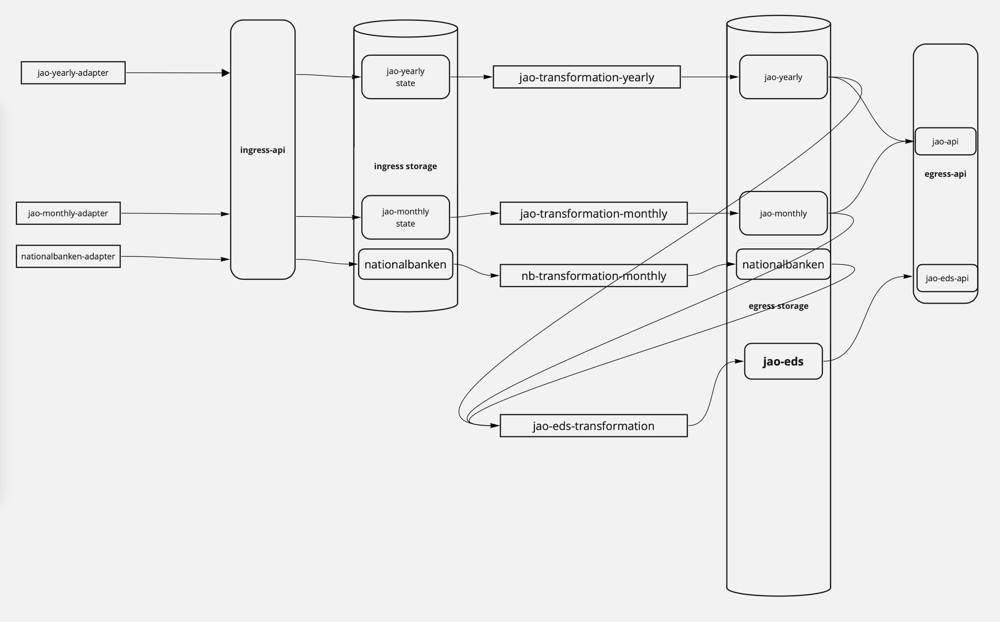

# transform-jao2eds
- [Introduction](#introduction)
  - [Overview and design choices](#overview-and-design-choices)
  - [Usage](#Usage)
- [Configuration](#configuration)
  - [Logging](#logging)
- [Development](#development)
  - [tox](#tox)
  - [Commands](#commands)
    - [Linting](#linting)
    - [Tests](#tests)
  
## Introduction

This transforms data from JAO-Monthly, JAO-Yearly and Nationalbanken to JAO-EDS.

### Overview and design choices
The transformation reads data from 3 sources and writes to one source.



As shown in the diagram above it reads from jao-yearly, jao-monthy, and nationalbanken.

The transformation is designed to re-calculate the transformation each day. 
That is, it reads all the data (from a configurable starting point) to current date for the configured corridors.
The data will be available from an endpoint in the egress-api.

The transformation reads data (jao-yearly, jao-monthly, nationalbanken) directly from egress storage and not through
a middle-layer endpoint like the egress-api. This implies, if the underlying storage changes, this transformation needs
to change too.

The choice to re-calculate all data each day is to ensure the consistency between data from jao-yearly, jao-monthly,
and nationalbanken (if changes are made to historic data it will be updated).

### Usage
```sh
$ python -m transform_jao2eds
```

## Configuration

The application needs a configuration file `conf.ini` (see `conf.example.ini`) and a credentials file `credentials.ini`
(see `credentials.example.ini`). The configuration file must 
be placed in the root of the project or in the locations `/etc/osiris/conf.ini` or 
`/etc/transform-eds2jao-conf.ini`. 

```
[Logging]
configuration_file = log.conf

[Azure Storage]
account_url = https://<storage_account>.dfs.core.windows.net
filesystem_name = <container_name>

[Nationalbanken]
guid = <guid>

[JAO]
monthly_guid = <guid>
yearly_guid = <guid>

[JAO EDS]
guid = <guid>
start_date = <yyyy-mm-dd>
borders =
     D1-DE
     D2-DE
```

The credentials file must be placed in the root of the project or in the
location `/vault/secrets/credentials.ini`

```
[Authorization]
tenant_id = <tenant_id>
client_id = <client_id>
client_secret = <client_secret>
```

### Logging
Logging can be controlled by defining handlers and formatters using [Logging Configuration](https://docs.python.org/3/library/logging.config.html) and specifically the [config fileformat](https://docs.python.org/3/library/logging.config.html#logging-config-fileformat). 
The location of the log configuration file (`Logging.configuration_file`) must be defined in the configuration file of the application as mentioned above.

Here is an example configuration:
```
[loggers]
keys=root

[handlers]
keys=consoleHandler,fileHandler

[formatters]
keys=fileFormatter,consoleFormatter

[logger_root]
level=ERROR
handlers=consoleHandler

[handler_consoleHandler]
class=StreamHandler
formatter=consoleFormatter
args=(sys.stdout,)

[handler_fileHandler]
class=FileHandler
formatter=fileFormatter
args=('logfile.log',)

[formatter_fileFormatter]
format=%(asctime)s - %(name)s - %(levelname)s - %(message)s
datefmt=

[formatter_consoleFormatter]
format=%(levelname)s: %(name)s - %(message)s
```

#### Grant access to the dataset
The application must be granted read access to the ingress dataset and write access to the egress dataset on 
[the Data Platform](https://dataplatform.energinet.dk/).

## Development

### tox

Development for this project relies on [tox](https://tox.readthedocs.io/).

Make sure to have it installed.

### Commands

If you want to run all commands in tox.ini

```sh
$ tox
```

#### Linting

You can also run a single linter specified in tox.ini. For example:

```sh
$ tox -e flake8
```


#### Tests

(No test at the moment)

Run unit tests.

```sh
$ tox -e py3
```

Run a specific testcase.

```sh
$ tox -e py3 -- -x tests/test_main.py
```
